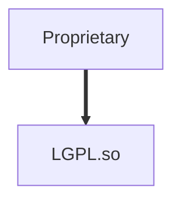
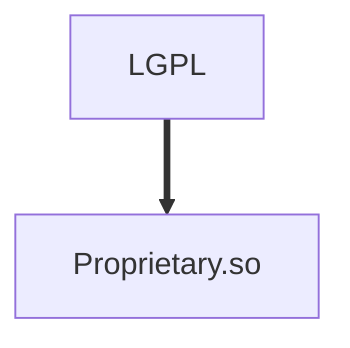
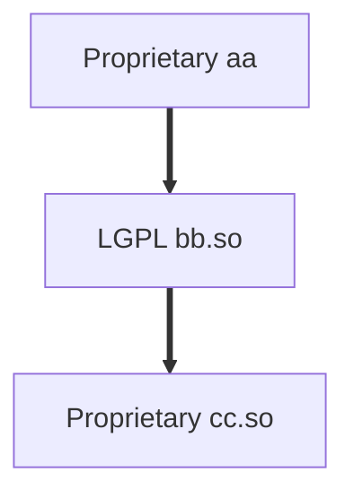
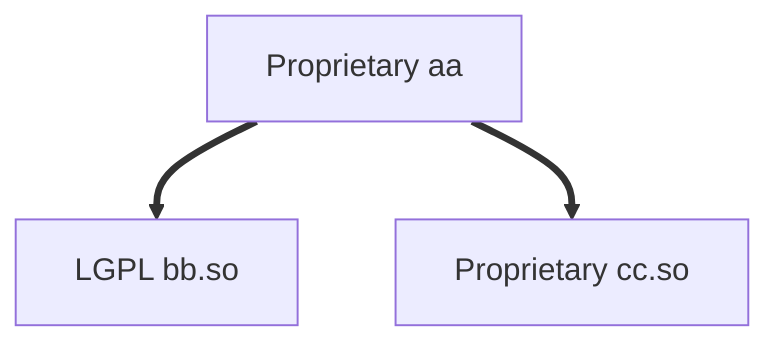

LGPL Contamination in Serial Dynamic Linking
============================================

The original concept for the "Library" or "Lesser" GNU Public License
(LGPL) was to provide a way for proprietary application software to use
(link to) a GNU library without the "viral" nature of the GPL creating a
license incompatibility.

In the following examples we have [_aa.c_](aa.c) which references
symbols in [_bb.c_](bb.c) which references symbols in [_cc.c_](cc.c).


Typical LGPL Linking
--------------------

E.g., a proprietary application linked to the
GNU libc. This innovation over the original GPL is what allows
commercial applications to run on GNU or, now, Linux.




Reverse LGPL Linking — Conflict?
--------------------

But what if the dynamic linking goes in other directions and the dynamic
library is proprietary? In other words, is linking directional? I
believe the answer is yes. Therefore, this situation is a **license
conflict**.

As a result, licensing application code as LGPL is silly ∵ it instantly
reverts to GPL.




Serial LGPL/Proprietary Linking — Conflict?
-------------------------------

What if we dynamically linked a proprietary library to the LGPL dynamic
library? This is possible with ELF. (Unknown on Windows PE/XCOFF object
files.)



_Note:_ the symbols inside _cc.so_ are accessible to _bb.so_, but not
the top-level _aa_ application. This demonstrates good information
hiding.

```sh
$ cc -fPIC   -c -o aa.o ../aa.c                         #Proprietary
$ cc -fPIC   -c -o bb.o ../bb.c                         #LGPL
$ cc -fPIC   -c -o cc.o ../cc.c                         #Proprietary
$ cc -shared -Wl,-soname,libcc.so -o libcc.so cc.o      #Proprietary
$ cc -shared -Wl,-soname,libbb.so -o libbb.so bb.o -lcc #Conflict?
$ cc -o aa aa.o -lbb
$ ldd aa libbb.so libcc.so
aa:
        linux-vdso.so.1 (0x00007fffb47b6000)
        libbb.so => ./libbb.so (0x00007efc6bf77000)
        libc.so.6 => /lib/x86_64-linux-gnu/libc.so.6 (0x00007efc6bd2f000)
        libcc.so => ./libcc.so (0x00007efc6bd2a000)
        /lib64/ld-linux-x86-64.so.2 (0x00007efc6bf83000)
libbb.so:
        linux-vdso.so.1 (0x00007fffc46de000)
        libcc.so => ./libcc.so (0x00007f503a922000)
libcc.so:
        statically linked
```

Is that the same as dynamically linking both libraries to the
application? ldd(1) suggests the latter even though `-lcc` was
not on the Application link command line: `cc -o aa aa.o -lbb`.


Parallel LGPL/Proprietary Linking — Conflict???
---------------------------------

What if we truly link both libraries to the same application?
Superficially, this looks OK in the diagram.



```sh
$ cc -fPIC   -c -o aa.o ../aa.c                    #Proprietary
$ cc -fPIC   -c -o bb.o ../bb.c                    #LGPL
$ cc -fPIC   -c -o cc.o ../cc.c                    #Proprietary
$ cc -shared -Wl,-soname,libcc.so -o libcc.so cc.o #Proprietary
$ cc -shared -Wl,-soname,libbb.so -o libbb.so bb.o #LGPL
$ cc -o aa aa.o -lbb -lcc
$ ldd aa libbb.so libcc.so
aa:
        linux-vdso.so.1 (0x00007fff7850f000)
        libbb.so => ./libbb.so (0x00007f5b23c38000)
        libcc.so => ./libcc.so (0x00007f5b23c33000)
        libc.so.6 => /lib/x86_64-linux-gnu/libc.so.6 (0x00007f5b239eb000)
        /lib64/ld-linux-x86-64.so.2 (0x00007f5b23c44000)
libbb.so:
        statically linked
libcc.so:
        statically linked
```

***Conflict???*** Even though _bb.so_ LGPL software doesn't technically
link a proprietary library, as above, the LGPL software does, in this
example, reference proprietary symbols in _cc.so_.


Serial/Parallel Compared
------------------------

The difference in serial vs. parallel linking above is in the link
steps. Which stage is the _cc_ shared object linked?

```sh
cc -o libcc.so cc.o      | cc -o libcc.so cc.o
cc -o libbb.so bb.o -lcc | cc -o libbb.so bb.o
cc -o aa aa.o -lbb       | cc -o aa aa.o -lbb -lcc
```
